# audio-signal-processing-using-matlab
An example of noise removal from an audio file, using matlab

## 信号滤波及信号参数计算

#### 设计要求
 1. 检测并计算干扰信号频率：f1、f2；
 2. 计算信号与干扰功率之比:（S/J）dB；
 3. 对信号进行滤波、抑制干扰；
 4. 画出处理后的频谱图、播放声音。

#### 1. 语音信号的时域分析及频域分析：
```matlab
%% 读取音频文件
[f, Fs] = audioread('handel_J.wav');
T = 1 / Fs;             % 采样周期
L = length(f);          % 信号长度
t = (0:L-1)*T;          % 时间
```
```matlab
%% 画时域图
N = size(f,1);
figure;  stem(t, f);
title('Original: Time-domain')
xlabel('time(seconds)')
```
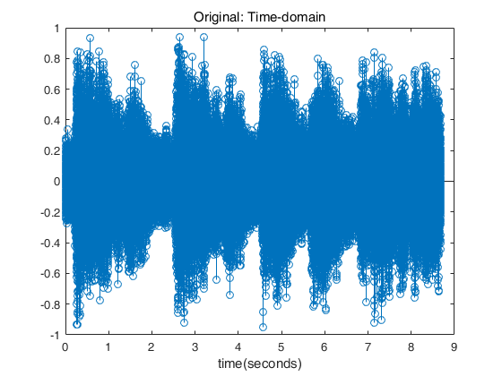
```matlab
%% 画频域图
df = Fs / N;
w = (-(N/2):(N/2)-1) * df;
y = fft(f) / N; % For normalizing
y2 = fftshift(y);
figure;  plot(w, abs(y2))
title('Original: Amplitude Spectrum')
xlabel('Frequency(Hz)')
```
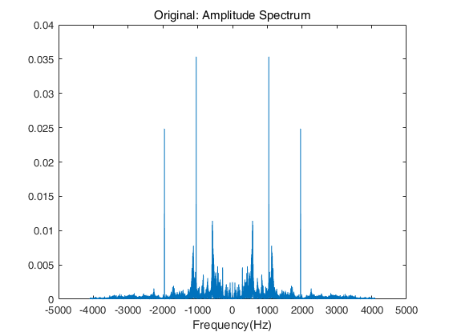
```matlab
%% 单边幅频图
figure;
plot(Fs * (0:(L/2))/L, abs(y2(N/2:end)))
title('Original: Single-Sided Amplitude Spectrum')
xlabel('Frequency(Hz)')
```
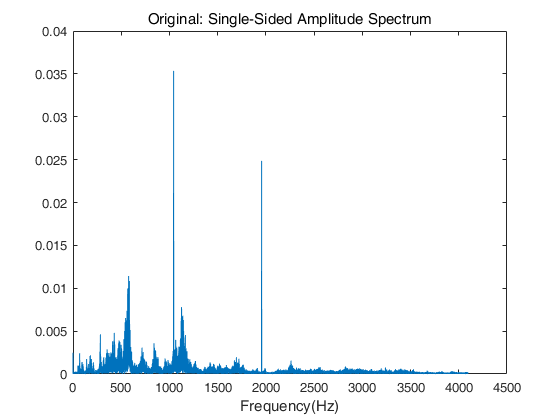
#### 2. 干扰信号频率检测及滤波
```matlab
%% 找到 f1=1043Hz
[fmax1, f1index] = max(abs(y2(N/2:end)));
fmax1, f1index = f1index * df

fmax1 =

    0.0354


f1index =

   1.0433e+03
```
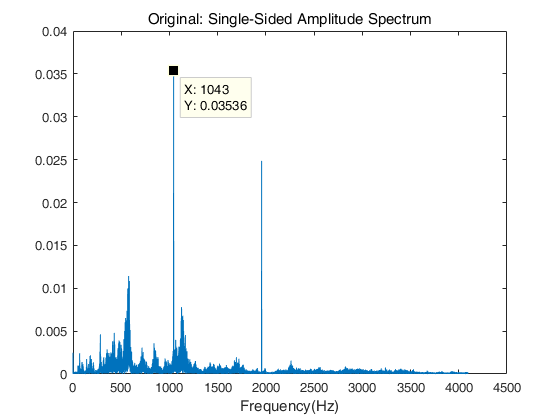
```matlab
%% 过滤 f1: 1043Hz
n = 2;
beginFreq = 1040 / (Fs/2);
endFreq = 1050 / (Fs/2);
[b, a] = butter(n, [beginFreq, endFreq], 'stop');
fOut = filter(b, a, f);
```
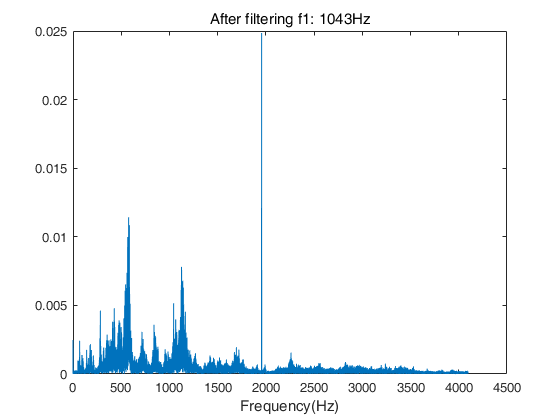
```matlab
% 提取 f1: 1043Hz
[b,a] = butter(n, [beginFreq, endFreq], 'bandpass');
f1 = filter(b, a, f);
figure;  plot(w, abs(fftshift(fft(f1)/N)));
title('f1: 1043Hz')
```
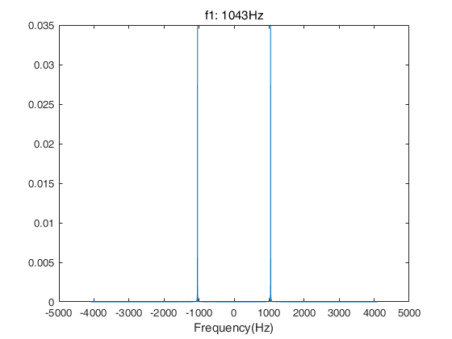
```matlab
%% 找到 f2=1956Hz
[fmax2, f2index] = max(abs(fftshift(fft(fOut)/N)));
fmax2, f2index = Fs/2 - f2index * df

fmax2 =

    0.0249


f2index =

   1.9556e+03
```
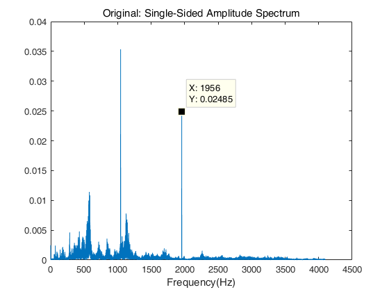
```matlab
%% 过滤 f2: 1956Hz
n = 2;
beginFreq = 1950 / (Fs/2);
endFreq = 1960 / (Fs/2);
[b,a] = butter(n, [beginFreq, endFreq], 'stop');
fOut = filter(b, a, fOut);
```
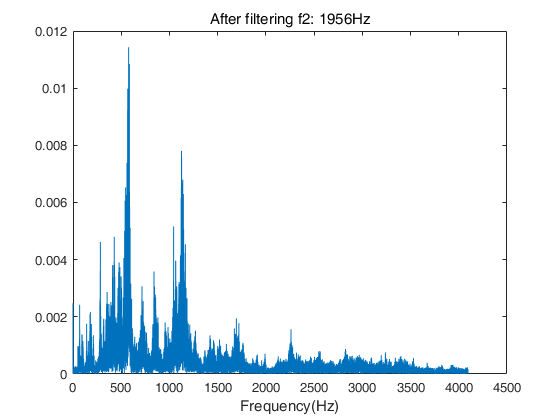
```matlab
% 提取 f2: 1956Hz
[b,a] = butter(n, [beginFreq, endFreq], 'bandpass');
f2 = filter(b, a, f);
figure;  plot(w,abs(fftshift(fft(f2)/N)));
title('f2: 1956Hz');
```
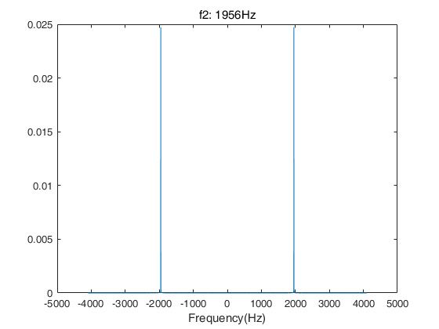
#### 参数测量结果
```matlab
%% SNR
snr(f,f1 + f2)

>> snr(f,  f1 + f2)

ans =

    8.5167
```
```matlab
%% 归一化处理
Ym = max(max(max(fOut)),max(abs(min(fOut))));
fOut = fOut ./ Ym;
```
```matlab
%% 处理后的时域图和频域图
figure;  stem(t, fOut);
title('After processing: Time-domain');
xlabel('time(seconds)');

figure;  plot(w, abs(fftshift(fft(fOut)/N)));
title('After processing: Amplitude Spectrum');
xlabel('Frequency(Hz)');
```
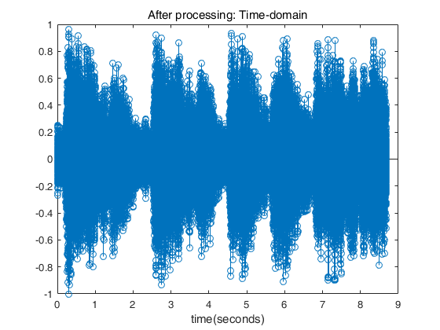
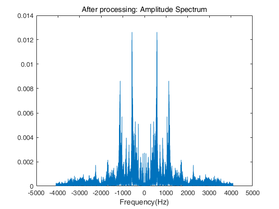

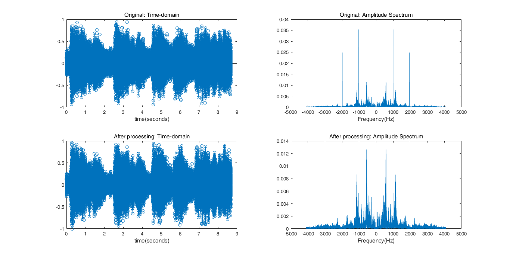
#### 试听滤波前，滤波后及f1,f2的声音。
```matlab
%% 创建音频播放对象
pOrig = audioplayer(f,Fs);  % 原始信号
% pOrig.play;
p = audioplayer(fOut, Fs);  % 滤波后信号
% p.play;
pf1 = audioplayer(f1, Fs);  % 噪声: f1: 1043Hz
% pf1.play;
pf2 = audioplayer(f2, Fs);  % 噪声: f2: 1956Hz
% pf2.play;
```
```matlab
%% 将处理后的信号保存至音频文件
audiowrite('handel_J_processed.wav', fOut, Fs);
```

